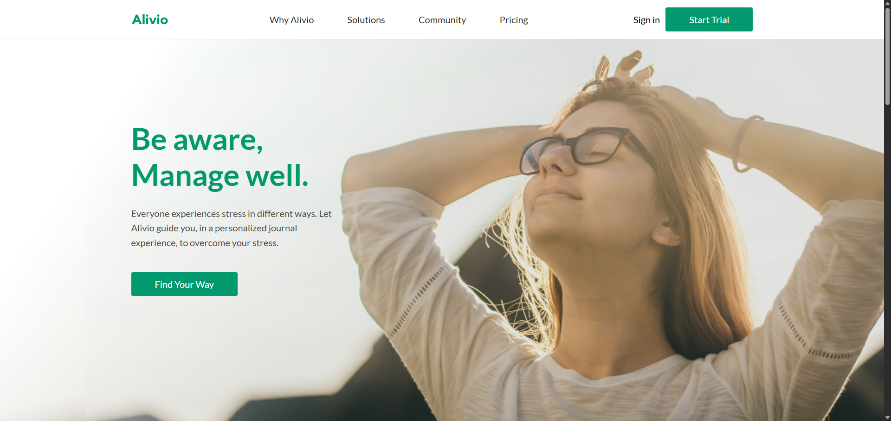

# 🌐 Alivio Landing

Простая вёрстка сайта по макету Figma без адаптации.

## 📸 Превью

)

## 🚀 Demo

👉 [Live Demo](https://nurbcode.github.io/alivio-landing/)  

## 🛠 Технологии

- **HTML5** — семантическая разметка
- **CSS3** — стилизация, адаптивная вёрстка
- **Flexbox / Grid** — построение сеток

## 📂 Структура проекта

```bash
project-name/
│── index.html      # Главная страница
│── style.css       # Основные стили
│── /images         # Папка с изображениями
```


